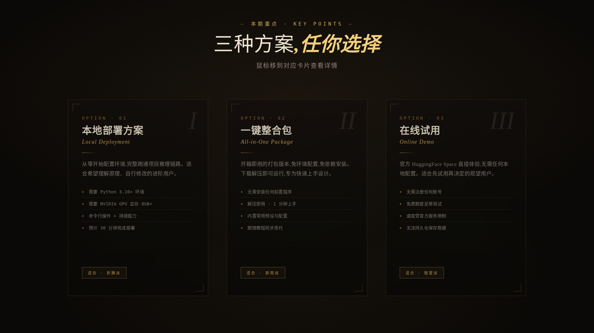
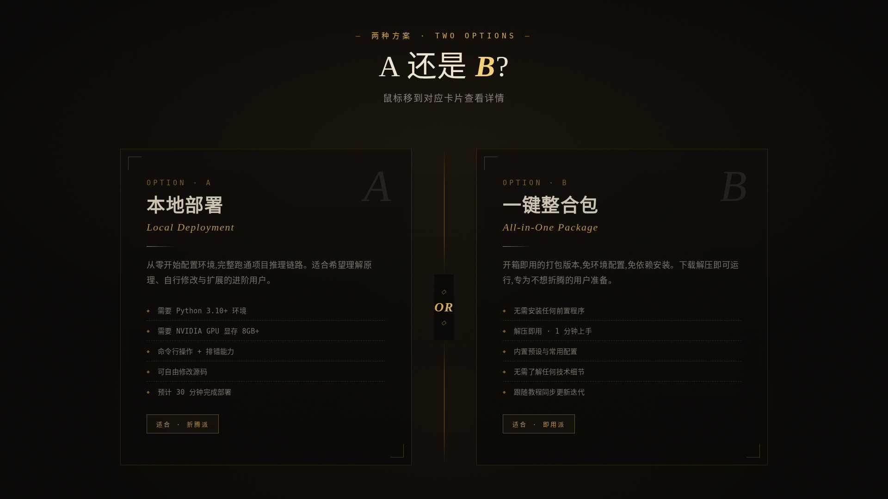
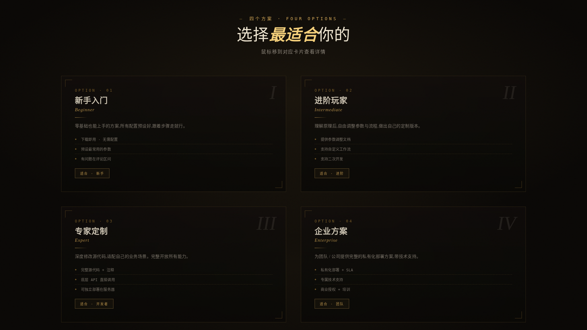
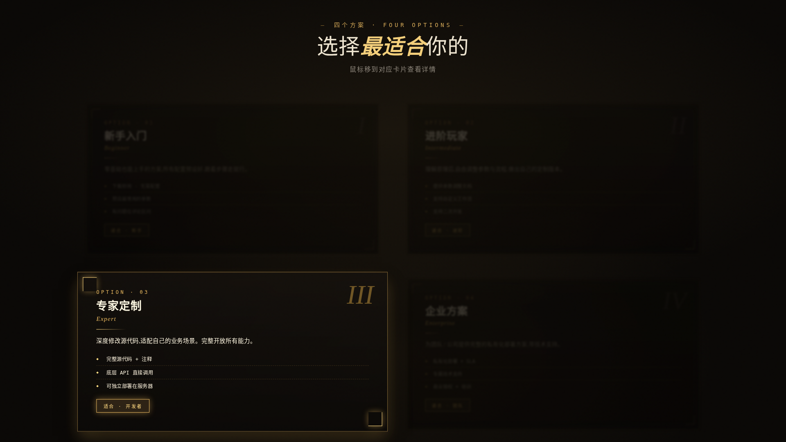

# HTML 课件模板 · HTML Courseware

> 一套用 HTML + CSS 制作的视频课件模板。
> 用来替代 PPT,做出有"录屏讲解"灵魂的高级感卡片。
>
> *A modern courseware template for tutorial videos.*

---

## 这是什么

录屏讲解视频里,我们经常需要"展示几个选项 / 三种方案 / 四个步骤"。

普通做法是用 PPT 或剪映模板——**做出来的画面平庸,毫无设计感**。

这个项目是一套 **HTML 课件模板**:暗金风设计语言、鼠标悬停聚焦效果、录屏友好的过渡动画。**讲到哪、鼠标移到哪、画面就聚焦到哪**,观众的视线自然被你牵着走。

适合所有需要在视频里讲解的场景:AI 工具教程、编程教学、知识科普、产品评测、培训演讲等。

---

## 效果展示

### 3 卡布局 · 三点说明

**默认状态:**



**鼠标悬停第二张卡 —— 其他卡变暗模糊,该卡放大发光:**


---

### 2 卡布局 · 二选一对比

**默认状态:**



**鼠标悬停效果:**


---

### 4 卡布局 · 2x2 网格

**默认状态:**



**鼠标悬停效果:**



---

## Quick Start

### 1. 下载模板

```bash
git clone https://github.com/wwzhifeng/html-courseware.git
cd html-courseware
```

或者直接下载 [`templates/`](./templates/) 文件夹里的 HTML 文件。

### 2. 改文字

用任何文本编辑器(VSCode / Sublime / 记事本都行)打开 HTML 文件,**修改 body 区域里的中文文字**。

每张卡需要改的内容:

- 卡片标题(如"本地部署方案")
- 英文副标(如"Local Deployment")
- 卡片描述(一段话)
- 要点列表(3-5 条)
- 底部标签(如"适合 · 折腾派")

### 3. 录屏使用

1. 用 Chrome 浏览器打开修改后的 HTML
2. 按 `F11` 进入全屏模式
3. 用录屏软件录制屏幕,**讲到哪,鼠标移到哪张卡**
4. 该卡自动放大发光,其他卡变暗模糊,完美的"聚光灯效果"

---

## 模板对比

| 布局 | 适用场景 | 每张卡内容容量 | 聚焦冲击力 |
|---|---|---|---|
| **2 卡** | 二选一 / VS 对比 / 决策 | 5-6 条要点 | 强(一暗一亮) |
| **3 卡** | 三种方案 / 三个步骤 / 三点说明 | 4 条要点 | 强(两暗一亮) |
| **4 卡** | 四象限 / 四类用户 / 完整矩阵 | 3 条要点 | **最强**(三暗一亮) |

---

## 设计哲学

**1. 留白即贵气**

卡片本身不大,周围有大量深色画布。整体像"漂浮在画布上的元素",而不是"填满画面的方块"。

**2. 聚光灯聚焦**

鼠标悬停时,**整个舞台变暗,只有被悬停的卡片亮起来**。这是 CSS `:hover` 冒泡的精妙利用:

```css
/* 容器被 hover → 所有卡变暗 */
.cards-stage:hover .card {
  opacity: 0.35;
  filter: brightness(0.6) blur(2px);
}

/* 但被 hover 的卡反向:变亮放大 */
.cards-stage .card:hover {
  opacity: 1;
  filter: brightness(1.1);
  transform: scale(1.04) translateY(-8px);
}
```

**3. 录屏友好的过渡时长**

动画 `transition: 0.5s` —— 太快观众跟不上,太慢节奏拖沓。0.5 秒是平衡点。

---

## 配色主题

默认是暗金风。要切换其他风格,在 HTML 顶部的 `:root` 区域修改 CSS 变量即可:

```css
:root {
  --bg-base: #0a0806;             /* 主背景色 */
  --gold-primary: #d4a857;        /* 主强调色 */
  --gold-bright: #f4cf7a;         /* 高亮强调色 */
  --gold-deep: #8a6a2e;           /* 深色强调 */
  --ink-primary: #ede4d0;         /* 主文字色 */
}
```

替换成你想要的配色就行。比如紫色赛博风:

```css
--gold-primary: #b873ff;
--gold-bright: #d4a8ff;
--gold-deep: #6a3ba5;
```

---

## 技术规格

- **画布尺寸**:1920×1080 (16:9)
- **依赖**:无,纯 HTML + CSS,不需要任何构建工具
- **字体**:Google Fonts 加载(Cormorant Garamond / Noto Serif SC / JetBrains Mono)
- **浏览器要求**:Chrome / Edge / Firefox / Safari 现代版本均可

---

## 文件结构

```
html-courseware/
├── README.md
├── LICENSE
├── templates/
│   ├── tutorial_card_2col.html    ← 2 卡布局
│   ├── tutorial_card_3col.html    ← 3 卡布局
│   └── tutorial_card_4col.html    ← 4 卡布局
└── examples/
    ├── card2_default.png
    ├── card2_hover.png
    ├── card3_default.png
    ├── card3_hover.png
    ├── card4_default.png
    └── card4_hover.png
```

---

## Roadmap

- [x] v0.1 · 3 种基础布局(2/3/4 卡)
- [ ] v0.2 · 时间轴 / 流程图模板
- [ ] v0.3 · 配套缩略图模板
- [ ] v0.4 · 多种配色主题预设
- [ ] v0.5 · Claude Skill 集成(让 AI 直接生成新模板)

---

## License

MIT — 自由使用,商用无忧。

---

## 关于作者

@[wwzhifeng](https://github.com/wwzhifeng) · DramaBox Studio 作者 · AI 工具教程创作者

如果这套模板帮到了你,欢迎 ⭐ Star 这个仓库 / 评论留下你的视频地址,让我看看你做出了什么。
